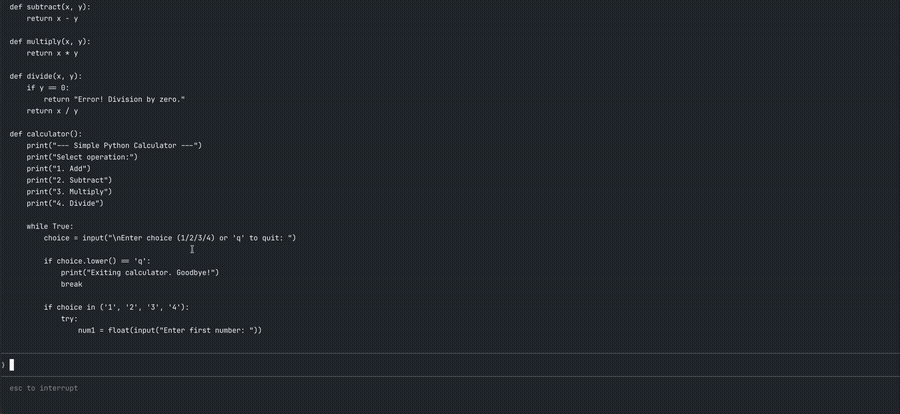

# local-llm-proxy



A lightweight proxy that translates the **Anthropic Messages API** into **OpenAI Chat Completions API**, enabling tools like [Claude Code](https://www.anthropic.com/claude-code) to run against any local LLM served by [llama.cpp](https://github.com/ggml-org/llama.cpp).

```
Claude Code (or any Anthropic SDK client)
        │  ANTHROPIC_BASE_URL=http://localhost:4000
        ▼
  anthropic-local-proxy  :4000
  Anthropic Messages API ↔ OpenAI Chat Completions
        │  http://localhost:8080
        ▼
  llama-server (llama.cpp)
  any GGUF model
```

## Features

- Full **streaming SSE** support (`content_block_start / delta / stop` events)
- **Tool call** round-trip translation (`tool_use` ↔ `function_call`)
- Multi-turn conversations with tool results
- Works with any OpenAI-compatible local server (llama.cpp, Ollama, LM Studio, …)

## Requirements

- **Node.js** 22+ (uses `--experimental-strip-types` to run TypeScript directly)
- **llama.cpp** `llama-server` — [install guide](https://github.com/ggml-org/llama.cpp#build)
- A GGUF model file

## Quick Start

### 1. Start llama-server

```bash
llama-server \
  -m /path/to/your-model.gguf \
  -ngl 99 \          # GPU layers — set to 0 for CPU-only
  -c 65536 \         # context window
  --flash-attn on \  # recommended for long contexts
  --reasoning off \  # disable thinking tokens if the model supports them
  --port 8080 \
  --host 127.0.0.1
```

> **Context size note**: Claude Code's system prompt is ~44K tokens.
> Use `-c 65536` or larger.

### 2. Start the proxy

```bash
node --experimental-strip-types anthropic-local-proxy.ts
```

### 3. Point your client at the proxy

```bash
export ANTHROPIC_BASE_URL="http://127.0.0.1:4000"
export ANTHROPIC_API_KEY="local"          # any non-empty string
export ANTHROPIC_MODEL="your-model-name"  # must match what llama-server loaded

claude  # or any Anthropic SDK client
```

## Configuration

All settings are via environment variables:

| Variable | Default | Description |
|---|---|---|
| `LLAMA_URL` | `http://127.0.0.1:8080` | llama-server base URL |
| `PROXY_PORT` | `4000` | Port the proxy listens on |
| `ANTHROPIC_MODEL` | `local-model` | Model name returned in responses |

## Using with Claude Code

Install Claude Code via npm:

```bash
npm install -g @anthropic-ai/claude-code
```

Then run with the proxy:

```bash
export ANTHROPIC_BASE_URL="http://127.0.0.1:4000"
export ANTHROPIC_API_KEY="local"
export ANTHROPIC_MODEL="your-model.gguf"
export ANTHROPIC_SMALL_FAST_MODEL="your-model.gguf"

claude --bare
```

The `--bare` flag skips OAuth/keychain auth and uses `ANTHROPIC_API_KEY` directly.

### Wrapper script example

```bash
#!/usr/bin/env zsh
# launch.sh

PROXY_PORT=4000
MODEL="your-model.gguf"

# Start proxy if not running
if ! curl -s "http://127.0.0.1:${PROXY_PORT}/health" >/dev/null 2>&1; then
  node --experimental-strip-types anthropic-local-proxy.ts \
    > /tmp/proxy.log 2>&1 &
  sleep 2
fi

export ANTHROPIC_BASE_URL="http://127.0.0.1:${PROXY_PORT}"
export ANTHROPIC_API_KEY="local"
export ANTHROPIC_MODEL="$MODEL"
export ANTHROPIC_SMALL_FAST_MODEL="$MODEL"

claude --bare "$@"
```

## Tested Models

| Model | Tool Use | Notes |
|---|---|---|
| supergemma4-26b-Q4_K_M | ✅ | Good for single-step tasks |

PRs welcome to expand this table.

## Known Limitations

- **Multi-step tool use reliability** depends heavily on the model's capability. 26B models may struggle with complex agentic workflows that require many sequential tool calls.
- **First response latency** is high (~60s) due to Claude Code's large system prompt being processed on each new session. Subsequent turns are faster due to KV cache.
- Vision / image content blocks are not forwarded to the upstream server.

## How It Works

Claude Code uses the Anthropic Messages API internally. By pointing `ANTHROPIC_BASE_URL` at this proxy, every API call is intercepted and translated:

**Request** (Anthropic → OpenAI):
- `system` prompt → `{"role": "system", ...}` message
- `tool_use` content blocks → `tool_calls` with `function` objects
- `tool_result` content blocks → `{"role": "tool", ...}` messages

**Response** (OpenAI → Anthropic):
- `choices[0].message.content` → `text` content block
- `tool_calls` → `tool_use` content blocks
- Streaming deltas → `content_block_delta` SSE events

## License

MIT
